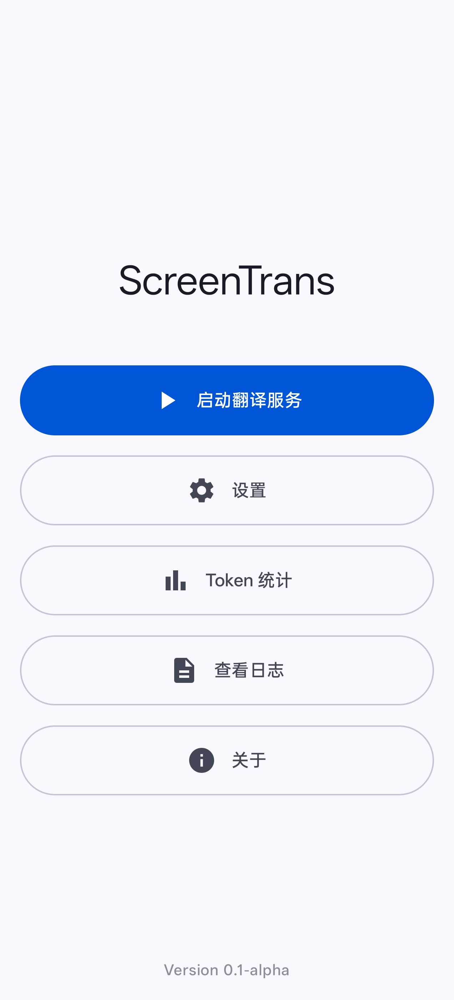
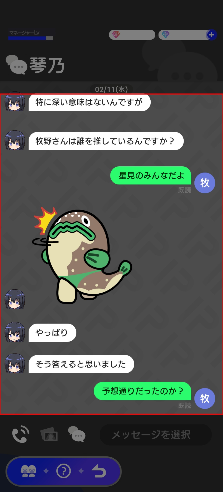
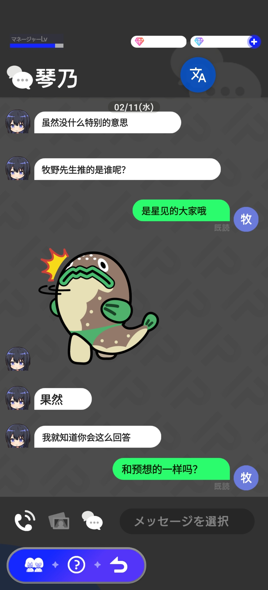
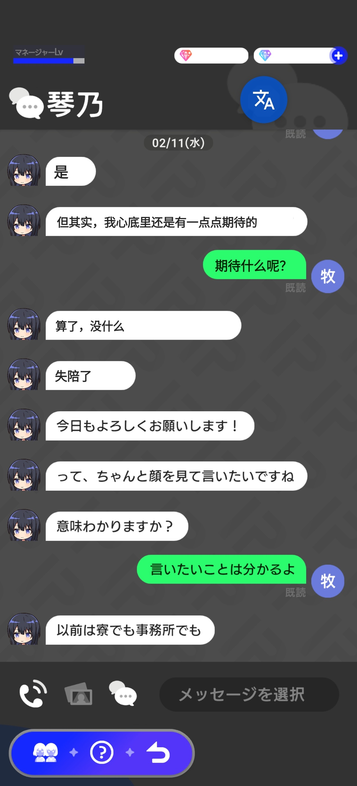
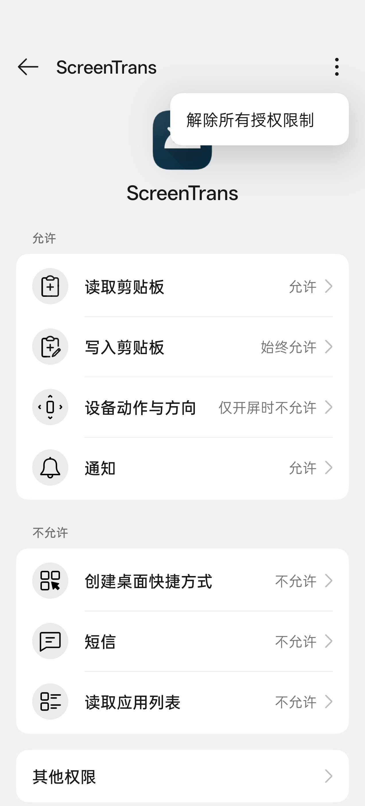
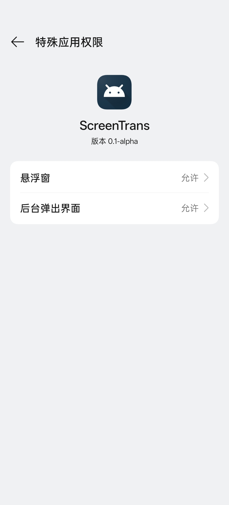

# ScreenTrans

[简体中文](README.zh_CN.md) | [English](README.md)

**该项目尚处于早期阶段。部分功能、错误处理、文档以及使用说明仍未完善。**

**本项目在开发过程中使用了 AI 辅助编程技术。尽管已尽力确保代码的正确性与稳定性，但无法保证完全没有错误或缺陷。如因本项目存在的任何 Bug 导致 API 被异常调用、滥用、数据泄露、服务中断或其他任何直接或间接的损失或后果，本人（及项目贡献者）不承担任何责任。您在使用本项目及相关 API 时，应自行评估风险，并承担由此可能带来的一切后果。**

一款支持自定义大模型 API 接口的开源 Android 屏幕 OCR 实时翻译工具。

## 下载

可以在 [GitHub Releases](https://github.com/longipinnatus/screentrans/releases/latest) 下载最新版本。

一般 Android 设备下载 `app-arm64-v8a-release.apk` 就可以了。

## 项目特点

### 1. 快速轻便的 OCR 识别能力
---
* **多模型支持**：内置轻量化 OCR 模型（支持简/繁中、英、日），并支持加载自定义 ONNX 模型，以满足高精度识别或特定语言适配需求。
* **模型参数微调**：提供参数调节面板，支持针对不同清晰度的源文件优化识别参数，提升特定场景下的识别率。
* **竖排文本适配**：支持中日文竖排文本识别，契合漫画、小说及古籍的阅读场景。
* **横竖场景适配**：支持设备横屏与竖屏模式的无缝切换。

### 2. 自由的 LLM 大模型集成
---
* **标准 API 接入**：支持 OpenAI API 协议接口，兼容自定义 Endpoint。
* **流式输出**：支持翻译内容滚动返回，在处理多个文本框时无需等待整体响应，减少等待时间。
* **自定义翻译风格**：支持用户自定义 Prompt，可根据场景调整翻译风格以及术语。
* **用量透明化**：内置 Token 使用统计与计费功能，实时掌握 API 消耗成本。

### 3. 自动化流程
---
* **自定义排除逻辑**：支持基于文本框尺寸及正则表达式自动忽略无关区域，有效过滤页码、水印等。
* **剪贴板同步**：识别结果支持自动复制，可自由配置复制内容（仅原文、仅译文、或原译文对照）。

### 4. 个性化定制
---
* **字体自由度**：支持自定义显示字体，兼容外部 TTF/OTF 字体文件导入。
* **UI 透明度调节**：文本框与悬浮球透明度均可独立设置。
* **动态交互逻辑**：支持翻译结果倒计时自动隐藏，亦可切换为手动关闭模式，保持界面整洁。
* **颜色自适应**：支持背景颜色覆盖，使翻译文本框颜色与原背景自动融合，提供接近原生的视觉效果。

## 如何使用

默认已经设置好 DeepSeek API 的参数，只需要在设置里输入 API Key 就可以翻译了。

区域选择模式（默认设置）：

* 单击悬浮球是框选翻译；

* 双击可以进行更方便的垂直范围框选。

全屏翻译模式：单击识别全屏文字翻译（这项功能我用的少，效果不一定好）。

## 界面展示

游戏：偶像荣耀（アイプラ，IDOLY PRIDE），已设置过滤部分文字。

| 主界面 | 区域选择 | 翻译示例 1 | 翻译示例 2 |
| :---: | :---: | :---: | :---: |
|  |  |  |  |

## 权限要求

必须开启的权限：

* 悬浮窗权限：覆盖原文翻译所必需（如果无法打开，可能需要点击“解除所有权限限制”）
* 屏幕录制权限：用于截取屏幕图片进行 OCR 识别

推荐开启的权限：

* 通知权限：开启后可以稳定地通过后台 Toast 通知；
* 写入剪贴版权限：在一些定制系统里，需要设置为“始终允许”；
* 后台弹出界面权限：由于熄屏后系统会自动收回录屏权限，启用后可以方便地重新请求录屏权限；

| 权限设置 | 其他特殊权限 |
| :---: | :---: |
|  |  |

该项目以及文档正在建设中……
